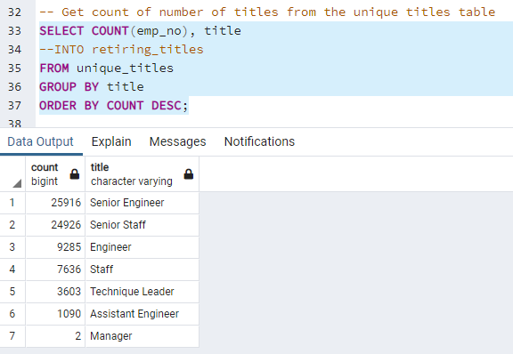

# Pewlett_Hackard_Analysis

## Overview of the analysis: 
The purpose of this analysis was to help Pewlett Hackard leadership prepare for a predicted "silver tsunami" of retirements in the company. Our goal was to help Pewlett Hackard future-proof the company by doing the following: 
- Setting up a SQL relational database using PostgreSQL
- Writing SQL queries in the pgAdmin client to analyze the data including:  
  - Determining how many people will be retiring and, of those employees, who is eligible for a retirement package.
  - Building a list of retiring employees by title to anticipate future employment needs for these roles.
  - Identifying seasoned professionals to serve as mentors for future employees.

## Results: 

Result highlights are outlined below:

- Point 1: Based on the count of unique titles of retirees, Pewlett Hackard will be losing a large amount of "Senior" employees, including 25,916 Senior Engineers. Given that the Pewlett Hackard company specializes in technology, it will be important to take proactive steps to remain competetive. 
- Point 2: The number of Senior Engineers far outweighs Engineers. Senior Engineers account for 71% of all engineers, Engineers account for 26% of all engineers, and Assistant Engineers account for only 3% of the total. In addition to the mentorship program, Pewlett Hackard will need to consider hiring more entry- or mid-level Engineers to supplement their workforce.   



- Point 3: Luckily, there are 529 Senior Engineers who are eligible to be mentors based on criteria outlined by PewLett Hackard.  
- Point 4: Interestingly, there are 29 Assistant Engineers who qualify to be mentors. Pewlett Hackard should analyze whether or not a promotion is deserved in these cases. If so, it would help them more adequately participate in the mentorship program. 

## Summary: 

The summary of this analysis will include discussion of two critically important questions regarding the future of Pewlett Hackard in the context of the predicted "silver tsunami":  

- How many roles will need to be filled as the "silver tsunami" begins to make an impact?
  - While all of these vacancies will not occur at the same time, there will be a staggering 72,458 positions to fill during the course of the "silver tsunami" at Pewlett Hackard based on our analysis. 
- Are there enough qualified, retirement-ready employees in the departments to mentor the next generation of Pewlett Hackard employees?
  - Given the initial requirements for mentorship eligibility, there have only been 1,549 mentors identified; therefore, it appears that there are not enough employees in the departments to account for these vacancies. 
  - My recommendation would be to expand the eligibility criteria for the mentorship program.
  - Pewlett Hackard will also need to hire more staff to account for all of the vacancies.  

Provide two additional queries or tables that may provide more insight into the upcoming "silver tsunami."

Two additional queries that may provide more insight into our analysis include the following: 
1. Code to obtain a count of the mentors for the next generation of Pewlett Hackard employees: 
  ```
  SELECT COUNT(emp_no) 
  FROM mentorship_eligibility;
  ```

2. Code for obtaining a count by title of the mentors to determine if there are any gaps in the mentorship program:
  ```
  SELECT COUNT(emp_no), title
  FROM mentorship_eligibility
  GROUP BY title
  ORDER BY COUNT DESC;
  ```

